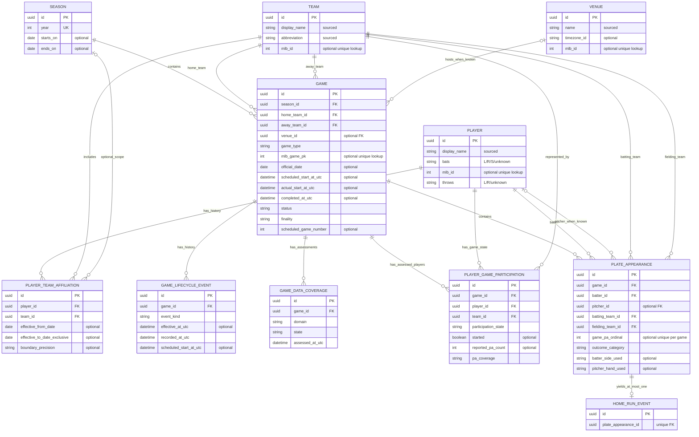
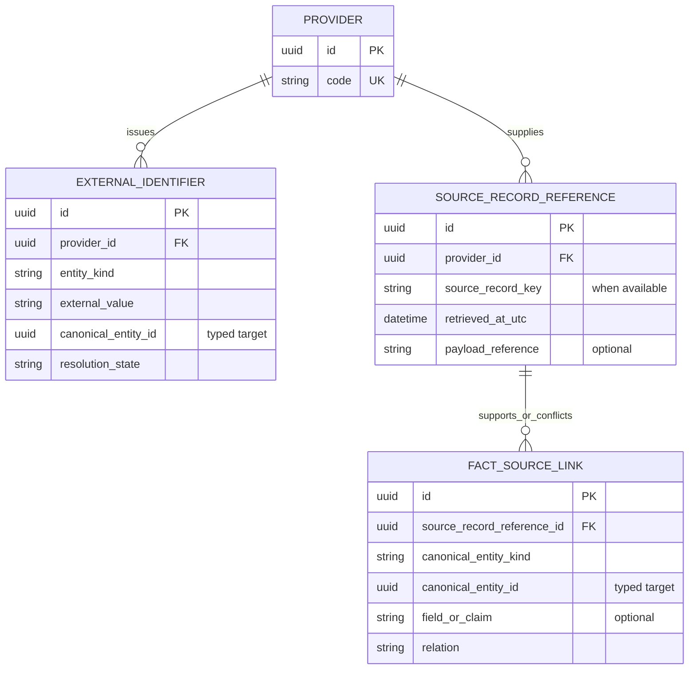

# MLB HR Intelligence — Conceptual ER diagram (0.0-B)

The primary diagram contains **core 0.1 identity, temporal relationship and observation entities**. The second diagram shows **supporting identity/provenance references** separately to keep the domain readable. These are conceptual entities, not created tables. All `id` fields are internal immutable canonical IDs; source IDs are separate. Optionality depicts possible unknown/unassessed data, not KPI eligibility.

`PlayerTeamAffiliation` is created only from dated temporal association evidence; a single game appearance does not establish its interval. `Team` has two distinct roles in `Game`. `PlateAppearance` likewise has batting and fielding team roles and a nullable pitcher reference. `PlayerGameParticipation` rows are unique by `(game, player, team)` and express assessed states; their absence means unassessed. `GameDataCoverage` is a current assessment per game/domain, with assessment history handled by the future ingestion design. `HomeRunEvent` obtains batter, game and team through its one PA, avoiding competing references.

## Supporting/provenance references

`ExternalIdentifier.canonical_entity_id` and `FactSourceLink.canonical_entity_id` are **typed references** to an existing core entity, not ordinary FKs to every entity shown in the primary diagram. Their target integrity requires domain/ingestion validation; the diagram deliberately avoids false direct FK claims. A canonical fact can have multiple source links and a source record can support several facts. Provider authority is in PROVIDER_STRATEGY; ingestion reconciliation is specified in RECONCILIATION_POLICY and INGESTION_ARCHITECTURE.

## Future extensions outside the core ERD

- **0.2:** Pitch/batted-ball tracking events link to a PA and, for an HR, may reconcile to `HomeRunEvent`; unmatched source observations retain their provenance.
- **0.3:** Time-aware park/roof and weather observations relate to venue/game/time; matchup joins use PA batter/pitcher and actual event sides.
- **0.4:** Versioned model artifacts reference input snapshots and subjects without becoming Player or Game identity fields.

See [DATA_MODEL.md](DATA_MODEL.md) for fields, time semantics and unresolved questions, and [DATA_INVARIANTS.md](DATA_INVARIANTS.md) for validation rules.
